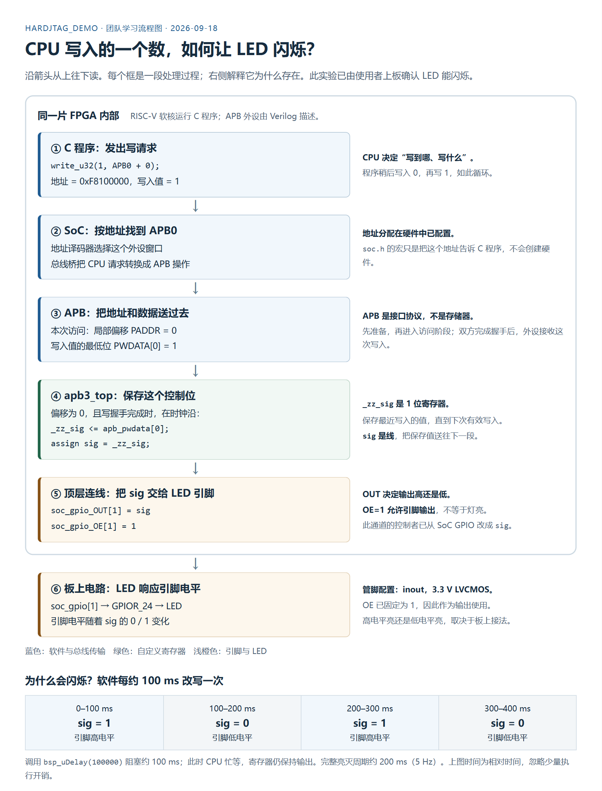

# FPGA2D硬件加速器

基于 **RISC-V + FPGA** 的 2D 图形硬件加速器学习记录。从 CPU 控制一个 LED 开始，逐步理解寄存器、总线、内存搬运和图形显示。

平台：Ti60F225 DemoBoard；当前实验基于 `09_Ti60F225_hardjtag_demo`。

## 第一次看，先从这里开始

1. 看下面的流程图，理解 CPU 写入的数据如何到达 LED。
2. 阅读 [第 01 课：CPU 通过 APB 控制 FPGA LED](docs/01-cpu-apb-led.md)，逐步对照软件和硬件。
3. 下载 [可展开说明的 HTML 版](docs/cpu-apb-led-flow.html)，用浏览器离线打开；可打印主流程图。
4. 阅读 [第 02 课：读懂 APB3 HDMI 控制模块](docs/02-apb3-hdmi-framebuffer.md)，分开理解端口、`assign`、读逻辑和写逻辑。
5. 阅读 [第 03 课：从一个 Verilog 文件读懂 HDMI 1080p 时序](docs/03-hdmi-video-timing.md)，并运行完整帧仿真。
6. 下载 [HDMI 时序交互讲解页](docs/hdmi-timing-explorer.html)，离线拖动坐标观察 `DE/HS/VS`。



## 当前已经跑通

- [x] RISC-V 基础程序运行。
- [x] RISC-V 写自定义 APB 外设，控制 FPGA 内部的 1 位寄存器。
- [x] 将该寄存器的输出接到板载 LED。
- [x] 软件使用阻塞延迟，每约 100 ms 切换一次电平；完整亮灭周期约 200 ms。
- [x] CPU 通过 APB0 写入 FPGA 片内 RGB565 帧缓存并控制 HDMI 有效图像。
- [x] 独立实现并逐像素验证 1920×1080、2200×1125 HDMI/DVI 视频时序。

上板结果由实验者确认。当前记录证明了这一位控制通路能够工作，尚不表示多寄存器、完整 32 位传输和读回都已验证。

## 后续学习方向

- [ ] 补齐 APB 顶层线网位宽，验证不同地址和多位数据。
- [ ] 加入寄存器复位、读回与状态查询。
- [ ] 验证 FPGA 通过 AXI 直接读写 DDR。
- [ ] 实现纯色填充和图像块拷贝。
- [ ] 接入视频输出与双缓冲。
- [ ] 扩展颜色键控、Alpha 混合与性能对比。

## 仓库内容

```text
README.md                     学习入口和当前进度
docs/
  01-cpu-apb-led.md            第 01 课：逐步讲解与代码片段
  cpu-apb-led-flow.png         可直接分享的流程图
  cpu-apb-led-flow.html        离线讲解页，可展开细节
  02-apb3-hdmi-framebuffer.md  APB3 HDMI 控制模块分段讲解
  03-hdmi-video-timing.md      HDMI横向/纵向时序与RTL逐段讲解
  assets/hdmi-1080p-timing.svg 1080p时序图
  hdmi-timing-explorer.html    可离线运行的时序交互讲解页
examples/
  apb3-hdmi/apb3_top.v         可独立综合的APB3教学版Verilog
  hdmi-timing/                 时序RTL、完整帧自检和小波形仿真
```

本仓库目前收录学习资料和教学片段，不是可独立综合的完整 FPGA 工程。厂商 SoC、DDR IP、工具链和编译产物未包含在内；源文件定位以原开发板工程为准。未确认的内容会明确标注，不把计划当作已经完成的功能。
