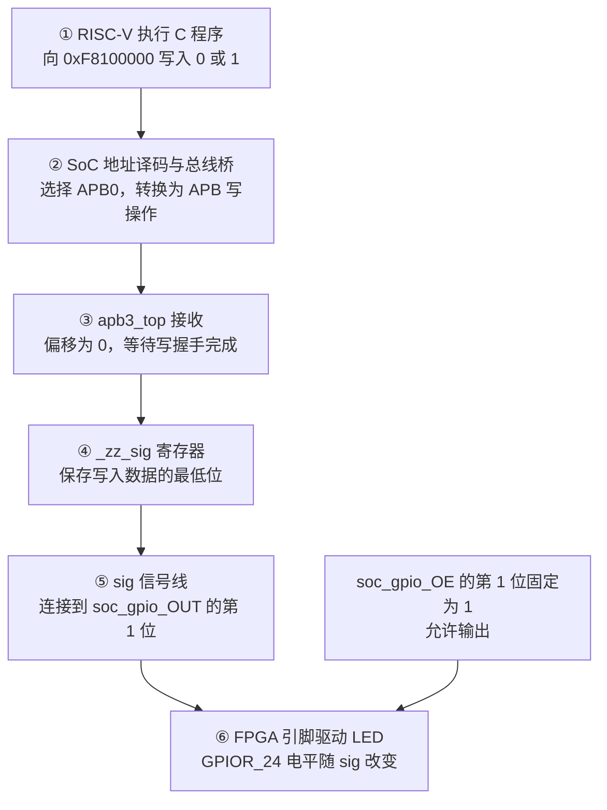

# 第 01 课：CPU 通过 APB 控制 FPGA LED

日期：2026-09-18。工程：`09_Ti60F225_hardjtag_demo`。实验结果：已由实验者上板确认 LED 闪烁。

## 1. 我们要验证什么？

让 RISC-V 软件向一个地址写入 0 或 1，由自己连接的 FPGA 外设接收，最终改变板载 LED 引脚的电平。

RISC-V 是这片 FPGA 内部的软核，自定义 APB 外设也在同一片 FPGA 内。



## 2. CPU 为什么写这个地址？

SoC 硬件已经为 APB0 分配了地址窗口 `0xF8100000`～`0xF810FFFF`。软件头文件记录了这个配置：

```c
#define IO_APB_SLAVE_0_INPUT 0xf8100000
```

`#define` 只是告诉软件地址是什么，不会创建硬件。CPU 发出写请求时，同时给出“地址、数据、写操作”；SoC 里的地址译码器按地址选择外设，总线桥生成 APB 操作。

本实验始终写窗口起点，所以 APB 外设使用的局部偏移是 `0`。

## 3. apb3_top 是什么？

它是 `par/ddr_demo_ti60/src/Interrupt.v` 里的 Verilog 模块。文件名与模块名不一样。

APB 是传输接口；`apb3_top` 是接收请求的从设备。它在偏移为 0、写握手完成时，在时钟沿保存写入数据的最低位：

```verilog
_zz_sig <= apb_pwdata[0];
```

握手判断为：

```verilog
factory_doWrite = apb_psel[0] && apb_penable
               && apb_pready && apb_pwrite;
```

`PSEL` 表示选中此外设；`PENABLE` 表示进入访问阶段；`PREADY` 表示外设准备完成；`PWRITE` 表示写操作。本例从设备固定返回 `PREADY=1`。

寄存器保存结果，信号线把结果引出：

```verilog
assign sig = _zz_sig;
```

`_zz_sig` 是寄存器，`sig` 是线。软件两次写操作之间，寄存器会保持原来的值。

## 4. 如何让这个值到达 LED？

原来的 LED 引脚由 SoC 内置 GPIO 控制。修改顶层后，GPIO1 改由 `sig` 驱动；其他 GPIO 保持原控制方式。

```verilog
wire       sig;
wire [3:0] soc_gpio_out_cpu;
wire [3:0] soc_gpio_oe_cpu;

// SoC 实例中的端口先接到内部线：
// .system_gpio_0_io_write       (soc_gpio_out_cpu),
// .system_gpio_0_io_writeEnable (soc_gpio_oe_cpu),

assign soc_gpio_OUT = {soc_gpio_out_cpu[3:2], sig,  soc_gpio_out_cpu[0]};
assign soc_gpio_OE  = {soc_gpio_oe_cpu[3:2],  1'b1, soc_gpio_oe_cpu[0]};
```

花括号从左到右对应 `[3]、[2]、[1]、[0]`。其中改变的只有：

```text
soc_gpio_OUT[1] ← sig
soc_gpio_OE[1]  ← 1
```

`OUT` 决定高低电平；`OE` 决定是否允许引脚输出。`OE=1` 不等于灯亮，只表示输出缓冲器打开。

此管脚在工程中配置为 `inout`，同时具备输入、输出能力。固定 `OE=1` 后就作为输出使用，无须在这个 C 程序里再初始化 SoC GPIO 控制器。

工程将 `soc_gpio[1]` 绑定到 `GPIOR_24`，电气标准是 `3.3 V LVCMOS`。实验者已确认该通道接到 LED。高电平还是低电平点亮取决于板上电路，本笔记不把“写 1”直接等同于“灯亮”。

## 5. C 程序如何实现 100 ms 闪烁？

沿用 BSP 和 APB 示例已有的函数与地址宏，在 `bsp_init()` 后执行：

```c
while (1) {
    write_u32(1, APB0 + EXAMPLE_APB3_SLV_REG0_OFFSET);
    bsp_uDelay(100000);

    write_u32(0, APB0 + EXAMPLE_APB3_SLV_REG0_OFFSET);
    bsp_uDelay(100000);
}
```

`write_u32(数据, 地址)`：注意数据在前，地址在后。`APB0` 是 `0xF8100000`，`EXAMPLE_APB3_SLV_REG0_OFFSET` 是 `0`。

`bsp_uDelay(100000)` 阻塞约 100000 微秒，即 100 毫秒。它通过 CLINT 计时器忙等；CPU 等待期间，FPGA 寄存器继续保持输出。

因此：高电平保持约 100 ms，低电平保持约 100 ms。每约 100 ms 切换一次，完整周期约 200 ms，频率约 5 Hz。

## 6. 修改和运行顺序

1. 修改 FPGA 顶层，让 `sig` 控制 LED，并固定输出使能。
2. 重新综合、布局布线，生成并下载 bitstream，让硬件连线生效。
3. 修改 APB 示例的 C 程序，交替写入 1 和 0。
4. 编译、下载并运行 C 程序，观察 LED 闪烁。

原工程关键文件：

| 内容 | 相对于 hardjtag_demo 的位置 |
| --- | --- |
| 顶层连线 | `rtl/ddr3_example_top.v` |
| 自定义 APB 外设 | `par/ddr_demo_ti60/src/Interrupt.v` |
| C 程序 | `par/ddr_demo_ti60/embedded_sw/soc/software/standalone/apb3/apb3Demo/src/main.c` |
| 地址定义 | `par/ddr_demo_ti60/embedded_sw/soc/bsp/efinix/EfxSapphireSoc/include/soc.h` |
| 引脚约束 | `par/ddr_demo_ti60/ddr_demo_ti60.peri.xml` |

## 7. 已验证的边界

本次确认的是“偏移 0 的 bit0 能控制 LED”，还没有完成以下验证：

- **读回：** 当前外设的 `apb_prdata` 固定为 0，读操作不能返回 `_zz_sig`。
- **复位：** 当前外设没有使用 reset 输入初始化 `_zz_sig`。本文的保存关系从第一次有效写入后开始。
- **多地址与多位数据：** 当前顶层的 `apb_paddr`、`apb_pwdata`、`apb_prdata` 缺少显式位宽声明；允许隐式线网时会成为 1 位线，导致截断。因为本例只写偏移 0 的 bit0，闪灯成功不能排除这个问题。扩展前应补齐声明；SoC 的 APB 地址端口是 16 位、数据是 32 位，外设地址端口目前为 32 位，需要明确零扩展连接。

这些是后续待处理项，本学习记录没有宣称已经修复或验证它们。
