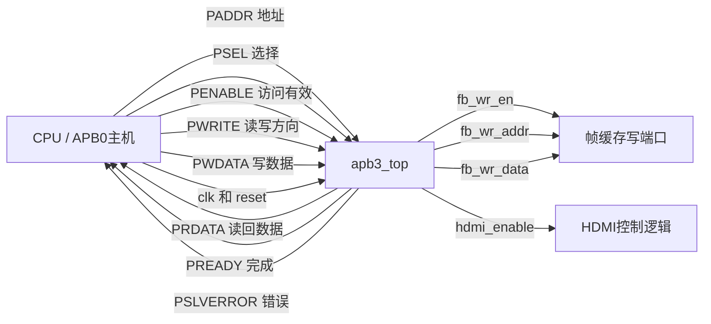
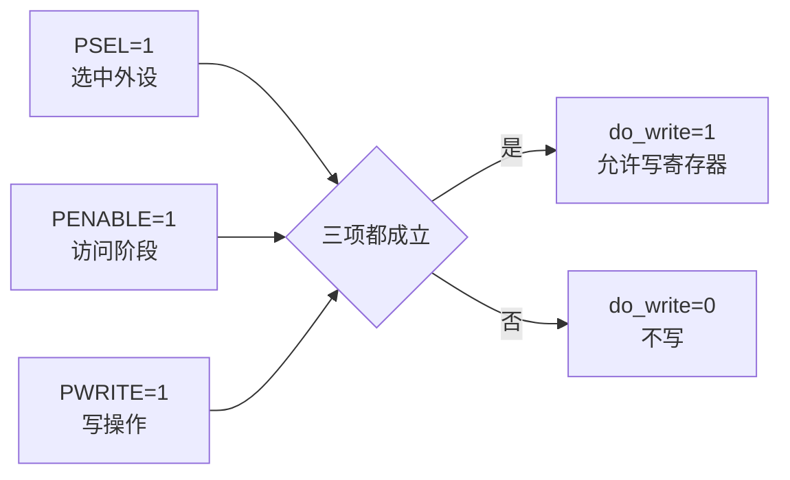
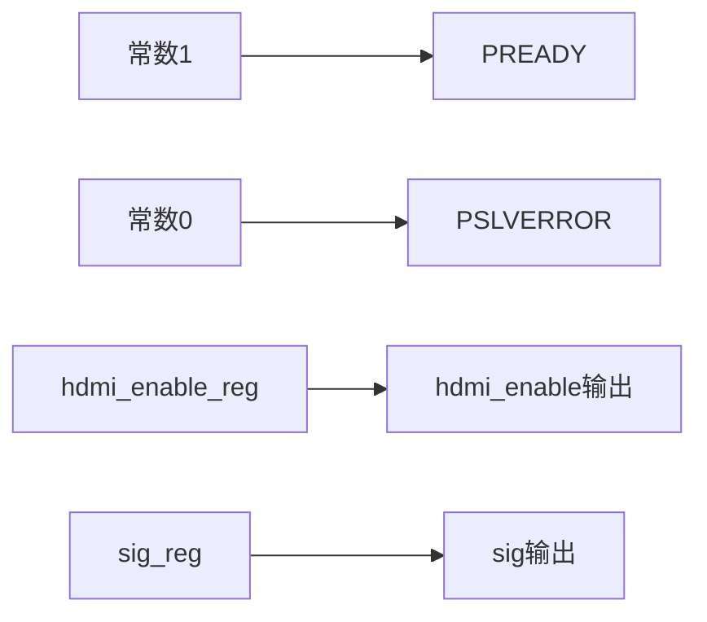
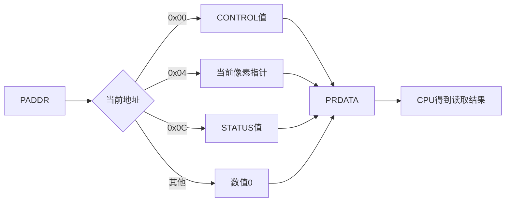
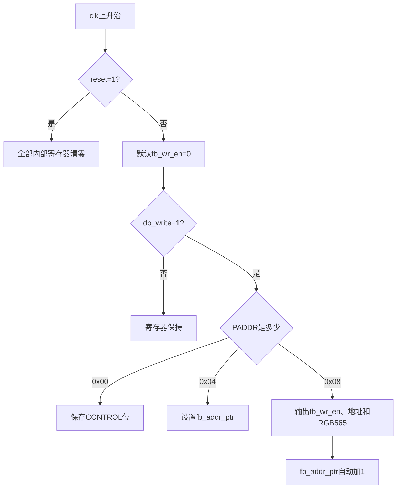
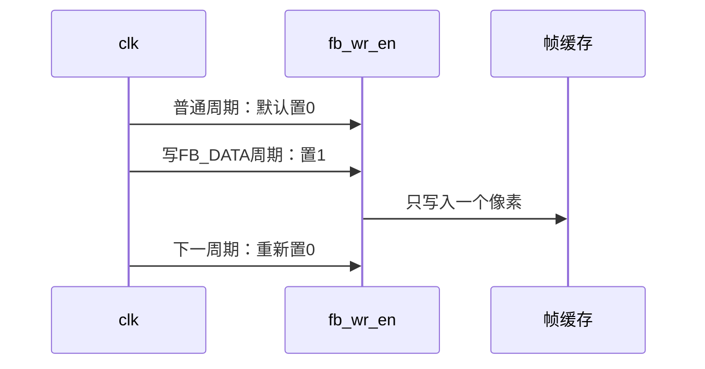
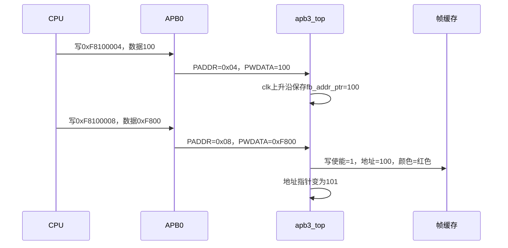

# 第 02 课：读懂 `apb3_top` HDMI 控制模块

这一课只研究一个文件：[`apb3_top.v`](../examples/apb3-hdmi/apb3_top.v)。它不是 HDMI 发送器，而是 CPU 与 HDMI 硬件之间的 APB3 控制接口。

## 1. 先看模块边界



左侧是CPU/APB0，右侧是FPGA内部的帧缓存和HDMI逻辑。CPU只访问寄存器，不直接产生HDMI时序。

## 2. 输入变量分别做什么

| 输入 | 宽度 | 谁产生 | 作用 |
|---|---:|---|---|
| `apb_paddr` | 32 | APB0 | 选择寄存器：`0x00`、`0x04`、`0x08`或`0x0C` |
| `apb_psel[0]` | 1 | APB0 | 为1表示当前选中了`apb3_top` |
| `apb_penable` | 1 | APB0 | 为1表示已经进入APB访问阶段 |
| `apb_pwrite` | 1 | APB0 | 1为写，0为读 |
| `apb_pwdata` | 32 | APB0 | CPU写入的32位数据 |
| `clk` | 1 | 系统时钟 | 驱动写寄存器和写脉冲，本工程为100 MHz |
| `reset` | 1 |复位逻辑 | 高电平时在下一个时钟上升沿清零寄存器 |

### 为什么要三个控制输入才能写



对应代码：

```verilog
assign do_write = apb_psel[0] && apb_penable && apb_pwrite;
```

## 3. 输出变量分别做什么

| 输出 | 宽度 | 送到哪里 | 作用 |
|---|---:|---|---|
| `apb_prdata` | 32 | CPU/APB0 | CPU读取寄存器时返回数据 |
| `apb_pready` | 1 | CPU/APB0 | 固定为1，表示无需等待 |
| `apb_pslverror` | 1 | CPU/APB0 | 固定为0，表示不报告总线错误 |
| `hdmi_enable` | 1 | HDMI核 | 1允许有效图像，0关闭有效图像 |
| `fb_wr_en` | 1 | 帧缓存 | 一个时钟周期的写使能脉冲 |
| `fb_wr_addr` | 16 | 帧缓存 | 当前要写的像素编号 |
| `fb_wr_data` | 16 | 帧缓存 | 当前像素的RGB565颜色 |
| `sig` | 1 | GPIO | 原Demo保留的输出位 |

## 4. `assign` 不是执行步骤，而是一直存在的电路



```verilog
assign apb_pready    = 1'b1;
assign apb_pslverror = 1'b0;
assign sig           = sig_reg;
assign hdmi_enable   = hdmi_enable_reg;
```

这些连线一直有效，不等待`clk`。例如`hdmi_enable_reg`变为1后，`hdmi_enable`也随之变为1。

## 5. 第一个 `always`：CPU读寄存器



```verilog
always @(*) begin
  case (apb_paddr)
    REG_CONTROL: apb_prdata = {30'd0, hdmi_enable_reg, sig_reg};
    REG_FB_ADDR: apb_prdata = {16'd0, fb_addr_ptr};
    REG_STATUS:  apb_prdata = {16'd57600, 15'd0, hdmi_enable_reg};
    default:     apb_prdata = 32'd0;
  endcase
end
```

这是组合逻辑：`PADDR`一变化，`PRDATA`就选择新的内容。它只负责读取，不会修改寄存器。

## 6. 第二个 `always`：CPU写寄存器



这里使用`<=`非阻塞赋值，因为它描述的是时钟触发器。假设原指针为100：

```verilog
fb_wr_addr  <= fb_addr_ptr;
fb_addr_ptr <= fb_addr_ptr + 1'b1;
```

同一时钟边沿之后，结果是`fb_wr_addr=100`、`fb_addr_ptr=101`。

## 7. 为什么 `fb_wr_en` 每拍先清零



因此一次CPU写操作只产生一次RAM写入，不会因为`fb_wr_en`保持为1而反复写。

## 8. 写入一个红色像素

```c
write_u32(100,    0xF8100004);
write_u32(0xF800, 0xF8100008);
```



## 9. 四个寄存器

| CPU绝对地址 | APB内部偏移 | 名称 | 作用 |
|---:|---:|---|---|
| `0xF8100000` | `0x00` | CONTROL | bit1控制HDMI，bit0控制`sig` |
| `0xF8100004` | `0x04` | FB_ADDR | 设置下一次写入的像素编号 |
| `0xF8100008` | `0x08` | FB_DATA | 写RGB565颜色，写指针自动加1 |
| `0xF810000C` | `0x0C` | STATUS | 读取HDMI状态和帧缓存大小 |

一句话记忆：输入APB信号描述CPU“要访问哪里、要读还是写、数据是什么”；`apb3_top`把这些信号转换成HDMI开关和帧缓存写入脉冲。
