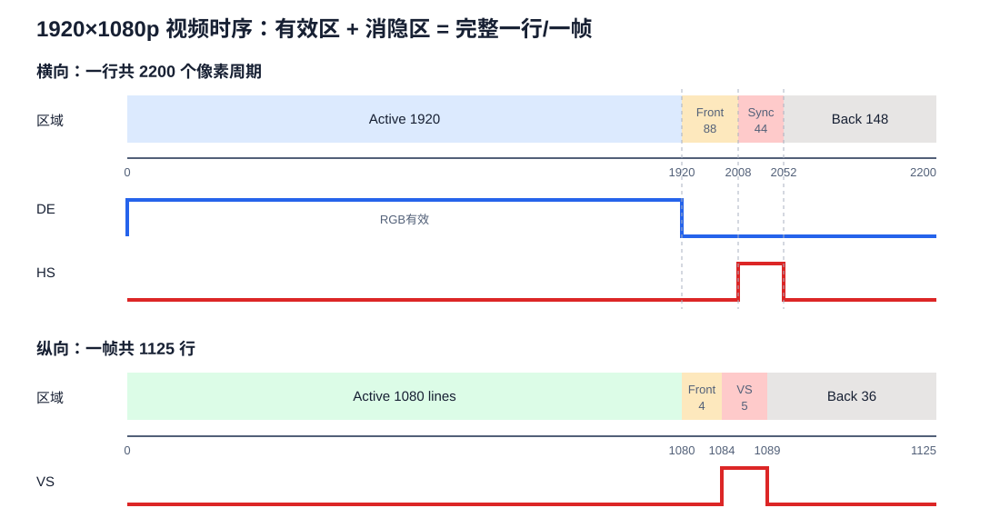
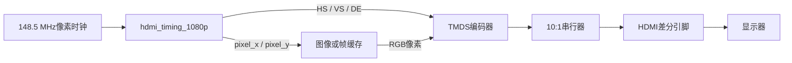
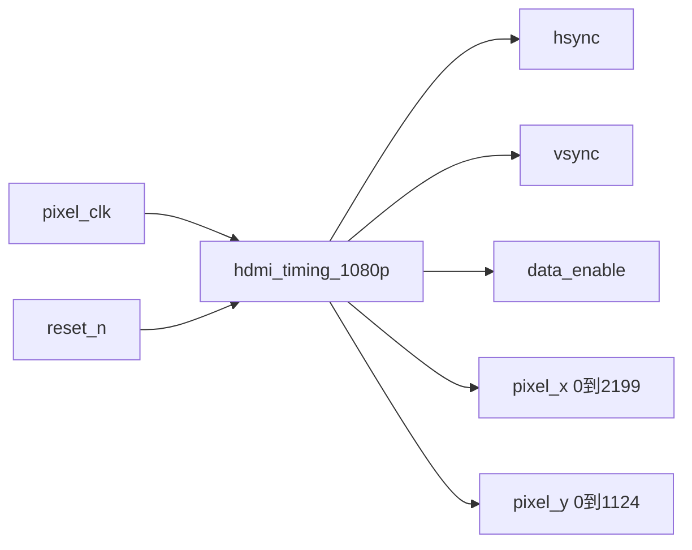
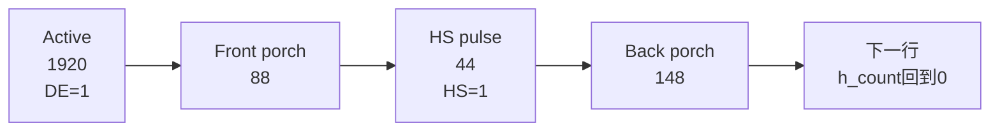
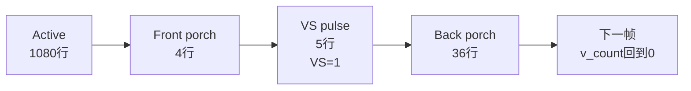
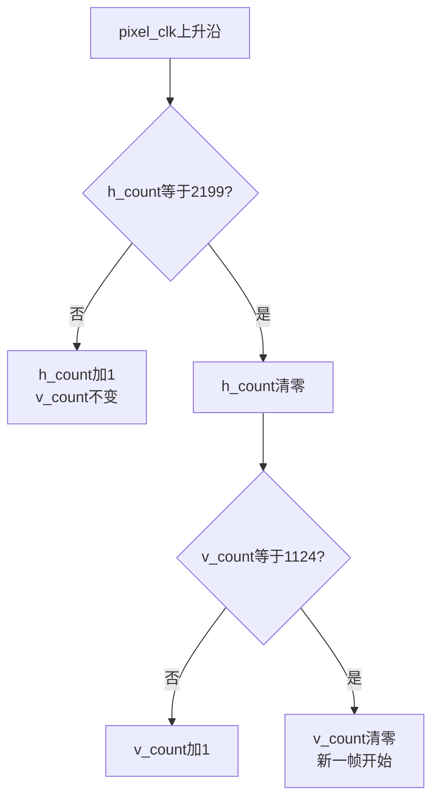
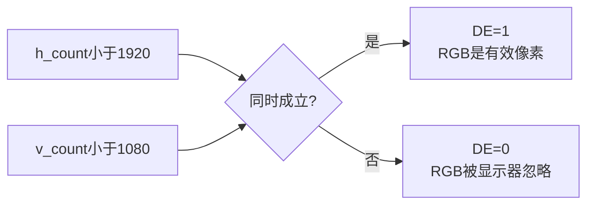

# 第 02 课：从一个 Verilog 文件读懂 HDMI 1080p 时序

本课只重点研究一个文件：[`hdmi_timing_1080p.v`](../examples/hdmi-timing/rtl/hdmi_timing_1080p.v)。学完后应该能够回答：一个像素时钟如何变成`HS`、`VS`和`DE`，以及显示器为什么能分辨一行、一帧和有效图像。

想先动手观察信号，可以下载并用浏览器打开[HDMI时序交互讲解页](hdmi-timing-explorer.html)。拖动`h_count`和`v_count`，页面会直接计算当前`DE/HS/VS`。



## 1. 这个模块在HDMI发送链中的位置



时序模块不产生颜色，也不直接驱动HDMI引脚。它只告诉后级：现在处于哪个像素位置、当前是不是有效图像、何时换行、何时换帧。

## 2. 输入和输出



| 端口 | 方向 | 作用 |
|---|---|---|
| `pixel_clk` | 输入 | 每个上升沿前进一个像素周期 |
| `reset_n` | 输入 | 低电平异步复位，坐标回到`(0,0)` |
| `hsync` | 输出 | 行同步脉冲，让显示器识别一行的边界 |
| `vsync` | 输出 | 场同步脉冲，让显示器识别一帧的边界 |
| `data_enable` | 输出 | 为1时RGB数据才属于可见图像 |
| `pixel_x` | 输出 | 当前水平位置；只在`DE=1`时是有效图像坐标 |
| `pixel_y` | 输出 | 当前垂直位置；只在`DE=1`时是有效图像坐标 |

## 3. 一行为什么不是只有1920个时钟

一行包含四段：

| 横向区域 | `h_count`范围 | 长度 | 含义 |
|---|---:|---:|---|
| Active | 0～1919 | 1920 | 真正显示像素，`DE=1` |
| Front porch | 1920～2007 | 88 | 有效图像结束后的等待区 |
| Sync | 2008～2051 | 44 | `HS=1`的行同步脉冲 |
| Back porch | 2052～2199 | 148 | 下一行有效图像前的等待区 |

所以：

```text
H_TOTAL = 1920 + 88 + 44 + 148 = 2200 个像素周期
```



“Porch”不是额外显示的黑色像素，而是视频传输必须保留的消隐时间。此时`DE=0`，显示器忽略RGB数据。

## 4. 一帧为什么不是只有1080行

垂直方向也有四段：

| 纵向区域 | `v_count`范围 | 长度 | 含义 |
|---|---:|---:|---|
| Active | 0～1079 | 1080 | 有效图像行 |
| Front porch | 1080～1083 | 4 | 最后一行图像后的等待区 |
| Sync | 1084～1088 | 5 | `VS=1`的场同步脉冲 |
| Back porch | 1089～1124 | 36 | 下一帧图像前的等待区 |

```text
V_TOTAL = 1080 + 4 + 5 + 36 = 1125 行
```



## 5. 两个计数器就是一个硬件版双重循环

C语言思维可以先写成：

```c
while (1) {
    for (y = 0; y < 1125; y++)
        for (x = 0; x < 2200; x++)
            output_timing(x, y);
}
```

Verilog用两个寄存器实现相同的扫描顺序：



对应唯一的时序`always`：

```verilog
always @(posedge pixel_clk or negedge reset_n) begin
  if (!reset_n) begin
    h_count <= 12'd0;
    v_count <= 12'd0;
  end else if (h_count == H_TOTAL - 1) begin
    h_count <= 12'd0;
    if (v_count == V_TOTAL - 1)
      v_count <= 12'd0;
    else
      v_count <= v_count + 1'b1;
  end else begin
    h_count <= h_count + 1'b1;
  end
end
```

关键点：`v_count`不是每个像素加1，而是`h_count`走完整整一行后才加1。

## 6. `DE`如何得到

```verilog
assign data_enable = (h_count < H_ACTIVE) &&
                     (v_count < V_ACTIVE);
```



只有水平位置和垂直位置都在有效区，`DE`才为1。因此每帧`DE=1`的次数正好是：

```text
1920 × 1080 = 2,073,600 个像素周期
```

## 7. `HS`如何得到

```verilog
assign hsync = (h_count >= H_ACTIVE + H_FRONT) &&
               (h_count <  H_ACTIVE + H_FRONT + H_SYNC);
```

代入数字：

```text
h_count >= 1920 + 88      → h_count >= 2008
h_count <  1920 + 88 + 44 → h_count < 2052
```

所以`h_count=2008～2051`时`HS=1`，刚好44个时钟。每一行都出现一次。

## 8. `VS`如何得到

```verilog
assign vsync = (v_count >= V_ACTIVE + V_FRONT) &&
               (v_count <  V_ACTIVE + V_FRONT + V_SYNC);
```

代入数字：

```text
v_count >= 1080 + 4     → v_count >= 1084
v_count <  1080 + 4 + 5 → v_count < 1089
```

所以`v_count=1084～1088`时`VS=1`，刚好持续5整行。

## 9. 时钟频率决定刷新率

一帧需要的像素周期：

```text
2200 × 1125 = 2,475,000
```

使用标准148.5 MHz像素时钟：

```text
刷新率 = 148,500,000 / 2,475,000 = 60 Hz
行频率 = 148,500,000 / 2200 = 67.5 kHz
```

开发板原工程使用约148.75 MHz，因此刷新率约为60.101 Hz，显示器通常仍可锁定。

## 10. 如何连接图像源和TMDS编码器

```verilog
wire [11:0] x;
wire [11:0] y;
wire hs;
wire vs;
wire de;

hdmi_timing_1080p u_timing (
  .pixel_clk   (pixel_clk),
  .reset_n     (reset_n),
  .hsync       (hs),
  .vsync       (vs),
  .data_enable (de),
  .pixel_x     (x),
  .pixel_y     (y)
);

// x、y选择帧缓存像素；RGB、HS、VS、DE一起送入TMDS编码器。
```

TMDS编码器在`DE=1`时编码RGB，在`DE=0`时编码控制符号，其中蓝色通道携带`HS/VS`控制信息。

## 11. 仿真不是“看到能跑”，而是检查每个周期

[`tb_hdmi_timing_1080p.sv`](../examples/hdmi-timing/sim/tb_hdmi_timing_1080p.sv)逐像素检查完整一帧：

- 坐标是否严格按`0～2199`、`0～1124`运行；
- `DE`是否只在1920×1080有效区为1；
- 每行`HS`是否恰好44个周期；
- 每帧`VS`是否恰好5行；
- 帧结束后计数器是否回到`(0,0)`。

仿真还会打印`x=1920、2008、2052`以及`y=1080、1084、1089`这些边界事件。若修改前后肩或同步宽度，可以直接观察边界是否移动到预期位置。

运行：

```powershell
cd examples/hdmi-timing
./run.ps1
```

为了方便看波形，[`tb_hdmi_timing_small.sv`](../examples/hdmi-timing/sim/tb_hdmi_timing_small.sv)把参数缩小为`14×7`总时序，但使用完全相同的RTL，生成`hdmi_timing_small.vcd`。

### Efinity实际综合

运行：

```powershell
cd examples/hdmi-timing
./synthesize.ps1
```

在Efinity 2026.1、Ti60F225、I3时序模型下已经验证`map : PASS`。教学模块综合结果约为30个LUT4、24个FF和22个加法/比较单元，不使用RAM或DSP。综合后看到的核心硬件正是两个12位计数器和若干边界比较器。

## 12. 最常见的时序错误

1. 把总长度写成1920×1080，忘了同步和前后肩。
2. 在`h_count == H_TOTAL`时才清零，导致多出一个周期；正确比较`H_TOTAL-1`。
3. 让`v_count`每个像素都增加，而不是每行结束增加。
4. `DE`只判断水平方向，导致消隐行仍被当成有效图像。
5. 同步极性写反；本例1080p使用正极性HS和VS。
6. 像素时钟不匹配，导致刷新率偏离显示器可接受范围。
7. 图像数据经过RAM或流水线延迟后，没有把HS、VS、DE延迟相同拍数。

一句话记忆：`h_count/v_count`决定“现在在哪里”，`DE`决定“像素是否可见”，`HS`决定“何时换行”，`VS`决定“何时换帧”。
