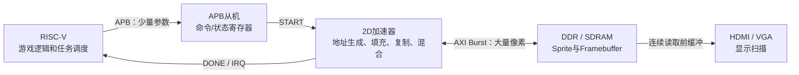

# 第 04 课：从 APB 命令到 AXI 2D 硬件加速

本课整理赛题二所需的核心思路：RISC-V 负责游戏逻辑和任务调度，FPGA 负责像素搬运与混合。重点不是已经完成的工程，而是下一阶段的架构设计、性能计算和验证方法。

> 当前仓库已经验证 CPU 通过 APB 写片内帧缓存；本文描述的 AXI Master、DDR Burst、命令 FIFO、双缓冲和 Sprite 流水线仍是待实现方案，不视为已上板功能。

## 1. 先分清控制通路和数据通路



APB 适合访问少量控制寄存器，但不支持 Burst。AXI 适合连续搬运图像数据。正确的分工是：

```text
RISC-V → APB写入操作、地址、宽高等参数
       → FPGA加速器作为AXI Master直接访问内存
```

不应让 CPU 通过 APB 逐像素写整幅图。那样 CPU 仍然是搬运工，FPGA 只是被动接收数据，无法体现硬件加速。

## 2. APB 的最小工作原理

常用信号：

| 信号 | 作用 |
|---|---|
| `PCLK` | APB 时钟 |
| `PRESETn` | 低有效复位 |
| `PSEL` | 选中当前从机 |
| `PENABLE` | 进入访问阶段 |
| `PWRITE` | 1 为写，0 为读 |
| `PADDR` | 寄存器地址 |
| `PWDATA` | 写数据 |
| `PRDATA` | 读数据 |
| `PREADY` | 从机表示访问完成 |
| `PSLVERR` | 从机报告访问错误 |

一次访问至少包含两个阶段：

```text
时钟周期       T0       T1       T2
阶段          IDLE     SETUP    ACCESS
PSEL           0        1        1
PENABLE        0        0        1
PREADY         x        x        1
PADDR                   有效     保持
PWDATA                  有效     保持
                               ↑传输完成
```

写寄存器的完成条件通常写成：

```verilog
wire apb_write = PSEL && PENABLE && PREADY && PWRITE;
```

等待周期中，地址、方向和写数据必须保持稳定。

## 3. 建议的 2D 加速器寄存器

| 偏移 | 名称 | 属性 | 作用 |
|---:|---|---|---|
| `0x00` | `CONTROL` | RW | bit0=`START`，可扩展 `IRQ_EN/ABORT` |
| `0x04` | `STATUS` | RO/W1C | `BUSY/DONE/ERROR` |
| `0x08` | `OPERATION` | RW | Block Copy、Solid Fill 等 |
| `0x0C` | `SRC_ADDR` | RW | 源图像首地址 |
| `0x10` | `DST_ADDR` | RW | 目标显存首地址 |
| `0x14` | `WIDTH` | RW | 区域宽度 |
| `0x18` | `HEIGHT` | RW | 区域高度 |
| `0x1C` | `SRC_STRIDE` | RW | 源图像每行字节数 |
| `0x20` | `DST_STRIDE` | RW | 目标图像每行字节数 |
| `0x24` | `FILL_COLOR` | RW | Solid Fill 颜色 |
| `0x28` | `ALPHA` | RW | Alpha 混合参数 |
| `0x2C` | `COLOR_KEY` | RW | 透明色 |

收到 `START` 后，加速器应先把配置复制到内部工作寄存器，再置 `BUSY=1`。这样 CPU 后续修改配置寄存器时，不会破坏正在执行的任务。

## 4. 示例：CPU 计算运动，FPGA 绘制方块

假设屏幕为 `640×480`、每像素 32 bit，显示一个碰到边缘后反弹的 `32×32` 红色方块。

CPU 只处理游戏逻辑：

```c
int x = 100, y = 80;
int vx = 3, vy = 2;

x += vx;
y += vy;

if (x <= 0 || x + 32 >= 640)
    vx = -vx;
if (y <= 0 || y + 32 >= 480)
    vy = -vy;
```

一行显存跨度为：

```text
pitch = 640 × 4 = 2560 Byte
```

方块左上角的目标地址为：

```c
dst_addr = back_buffer + y * pitch + x * 4;
```

CPU 通过 APB 下发一条 Solid Fill 命令：

```c
ACCEL_OPERATION  = OP_SOLID_FILL;
ACCEL_DST_ADDR   = dst_addr;
ACCEL_WIDTH      = 32;
ACCEL_HEIGHT     = 32;
ACCEL_DST_STRIDE = 2560;
ACCEL_COLOR      = 0x00FF0000;
memory_barrier();
ACCEL_CONTROL    = START;
```

CPU 没有 1024 次写像素循环。FPGA 收到命令后，每行通过 AXI Burst 写 32 个红色像素，然后把地址增加 `DST_STRIDE`，连续处理 32 行。

```text
第0行：dst_addr + 0 × 2560
第1行：dst_addr + 1 × 2560
...
第31行：dst_addr + 31 × 2560
```

全部完成后：

```text
BUSY = 0
DONE = 1
可选：IRQ = 1
```

如果要画图片而不是纯色方块，改为 Block Copy：FPGA 从 `SRC_ADDR` Burst 读取 Sprite，经 FIFO 后 Burst 写入 `DST_ADDR`。

## 5. 双缓冲如何避免撕裂

```text
显示控制器读取 Buffer A
加速器绘制 Buffer B
          ↓ VSYNC
显示控制器切换到 Buffer B
加速器开始绘制 Buffer A
```

显示地址应在 VSYNC 或垂直消隐边界切换，而不是绘制到一半时立即切换。双缓冲主要解决画面一致性，并不会自动提高加速器吞吐率。

对于 60 FPS，每帧渲染必须在约 `16.67 ms` 内完成，否则仍会错过交换时刻。

## 6. 性能首先看内存带宽

```text
每帧数据量 = 宽 × 高 × 每像素字节 × 读写次数
所需带宽   = 每帧数据量 × FPS
```

`640×480`、32 bit、60 FPS 时，单次全屏访问约为：

```text
640 × 480 × 4 × 60 ≈ 73.7 MB/s
```

| 操作 | 典型内存访问 |
|---|---|
| Solid Fill | 写目标 |
| Block Copy | 读源＋写目标 |
| Color Key | 读源＋对非透明像素写目标 |
| Alpha Blending | 读前景＋读背景＋写结果 |
| 显示扫描 | 读前缓冲 |

因此全屏 Block Copy 再加显示读取，理论流量已经约为 `221 MB/s`；如果每帧还全屏清屏，再增加约 `73.7 MB/s`。实际还要考虑 DDR 刷新、地址握手、仲裁和等待周期。

理论 AXI 带宽为：

```text
理论带宽 = 数据位宽 ÷ 8 × 时钟频率
```

例如 64 bit、100 MHz 的理论值是 `800 MB/s`，但有效带宽取决于 Burst 长度和总线利用率，不能只看理论数字。

## 7. 决定性能的主要因素

### 7.1 Burst 长度和地址连续性

整行连续地址适合长 Burst；大量很小、分散的图块会频繁重新发地址，效率降低。地址对齐、合理的行跨度和减少微小任务都有帮助。

### 7.2 FIFO 和读写重叠

```text
AXI Read → FIFO → 像素处理 → AXI Write
```

FIFO 用来吸收 DDR 延迟波动，并让读取、处理和写回同时工作。FIFO 频繁为空表示数据供不上；频繁写满表示后级或写通道跟不上。

### 7.3 像素流水线吞吐率

```text
像素吞吐率 = 时钟频率 × 每周期处理像素数 × 有效利用率
```

Alpha 混合即使有多级计算延迟，也应尽量流水化到填满后每周期接收或输出一个像素。延迟多拍不一定慢，关键是稳态吞吐率。

### 7.4 实际绘制面积和 Overdraw

同一位置被背景、角色、子弹和特效反复覆盖时，会重复读写显存。实际工作量更接近所有 Sprite 面积之和，而不是屏幕像素数。

### 7.5 内存仲裁

CPU、加速器和显示控制器会争用内存。显示扫描具有硬实时性，应优先避免显示 FIFO Underflow；渲染慢通常只是掉帧，显示断流则会花屏。

## 8. 高弹幕画面的典型瓶颈

高弹幕通常是“大量小 Sprite”，主要问题不是单个 Sprite 的计算复杂，而是命令多、访问碎片化和重叠严重。

以 1000 个 `16×16`、32 bit Sprite 为例：

```text
总Sprite像素 = 1000 × 16 × 16 = 256,000 像素/帧
```

如果全部 Alpha 混合，每个像素需要读前景、读背景、写结果：

```text
256,000 × 4 × 3 × 60 ≈ 184.3 MB/s
```

再加显示扫描和全屏清屏，理论流量约 `331.7 MB/s`，还没有计算协议和仲裁损耗。

### 8.1 命令提交瓶颈

如果每个 Sprite 都写多项 APB 寄存器并等待完成，CPU 和加速器会频繁互相等待。应加入命令 FIFO，或把命令表放在内存中，让 CPU 每帧只提交“命令表地址、数量、START”。

```text
RISC-V → 命令FIFO/命令表 → Sprite Engine
```

### 8.2 相同图案被反复读取

几千个子弹往往只使用少数几种图片。可在初始化时把常用 Sprite Atlas 缓存到 BRAM，渲染时从 BRAM 取前景像素，减少 DDR 源图读取。

### 8.3 透明像素和 Alpha 快速路径

```text
alpha = 0   → 完全透明，跳过
alpha = 255 → 直接写前景，不读背景
其他值      → 读背景并混合
```

Color Key 命中透明色时，也应跳过背景读取和目标写入。

### 8.4 CPU 游戏逻辑

CPU 还要更新大量子弹坐标并做碰撞检测。单个玩家与全部子弹检测通常是 `O(N)`；如果所有对象两两检测，可能迅速增长为 `O(N×M)`。可使用空间网格、简化碰撞盒、定点数或硬件碰撞单元。

### 8.5 更进一步：Tile-based 合成

将屏幕分块，把一个 Tile 读入片上 BRAM，在片上完成多个 Sprite 混合，最后一次写回 DDR，可以显著减少重叠画面的反复读改写，但控制逻辑也更复杂。

## 9. 建议增加的性能计数器

| 计数器 | 用途 |
|---|---|
| `command_count` | 每帧处理多少条命令 |
| `rendered_pixels` | 实际处理多少像素 |
| `transparent_pixels` | Color Key/Alpha 跳过多少像素 |
| `axi_read_bytes` | 实际读取字节数 |
| `axi_write_bytes` | 实际写入字节数 |
| `axi_stall_cycles` | 总线等待多少周期 |
| `fifo_empty_cycles` | 数据源供给不足时间 |
| `fifo_full_cycles` | 写回或后级阻塞时间 |
| `busy_cycles` | 加速器执行一帧所用周期 |

通过 APB 读回这些计数器，才能判断瓶颈到底在 CPU、命令调度、像素流水线还是内存总线。

## 10. 推荐实现顺序

1. 完成 APB 多寄存器读写、复位和状态读回。
2. 实现只写内存的 Solid Fill。
3. 实现 AXI Burst 和读写 FIFO。
4. 实现 Block Copy 与行跨度。
5. 接入双缓冲，在 VSYNC 切换。
6. 加入性能计数器，与 CPU 软件渲染比较。
7. 增加命令 FIFO、Color Key 和 Alpha 快速路径。
8. 最后挑战 Sprite Cache、碰撞优化和 Tile-based 合成。

一句话总结：APB 是任务单，AXI 是运输通道，FIFO 是中转仓库；RISC-V 决定画什么，FPGA 负责把大量像素高效搬到显存。

## 11. 资料依据

本文根据《全国大学生嵌入式芯片与系统设计竞赛 2026 FPGA 创新设计赛道选题指南（易灵思）》第 7～9 页的赛题二要求整理。题目要求 RISC-V 负责高层逻辑与指令下发，FPGA 实现 BitBlt、Solid Fill、显存访问、Burst、FIFO、双缓冲，并进一步挑战 Alpha Blending、Color Keying 和 60 FPS 下的 Sprite 数量。
