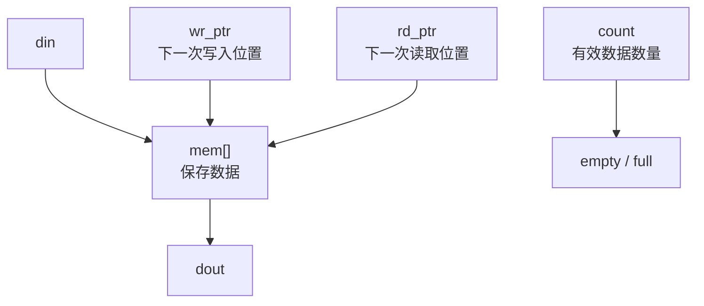
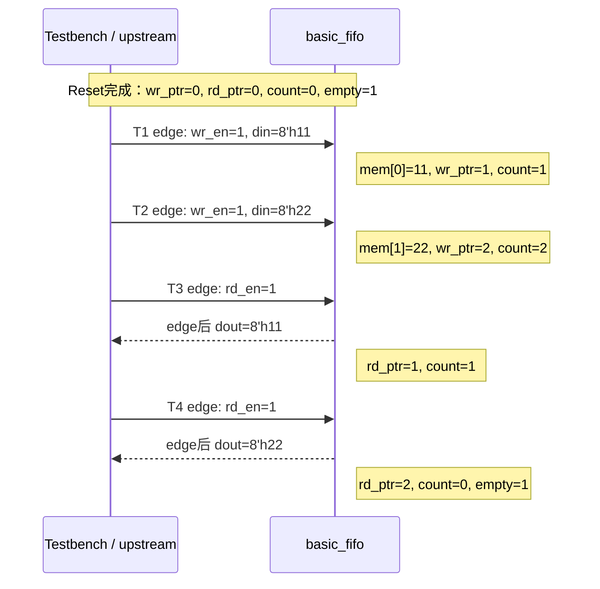
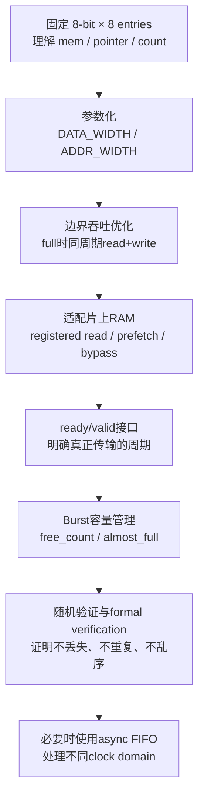
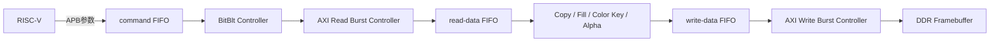

# 第 05 课：从基础 FIFO 到赛题二的数据缓冲

本课把 FIFO 的学习过程分成两部分：先用一个最小同步 FIFO 理解存储、指针、计数器和空满判断，再逐步把它扩展为适合 AXI Burst 与 BitBlt Engine 的工程模块。

> 本课配套代码位于 [`examples/basic-fifo`](../examples/basic-fifo/)。当前示例只实现并验证单时钟同步 FIFO，不包含 AXI Master、DDR Controller 或 Clock Domain Crossing。

## 1. FIFO 在赛题二里解决什么问题

赛题二要求 RISC-V 下发绘图命令，FPGA 通过 AXI4/Wishbone 从 DDR/SDRAM 搬运像素，并使用 Burst Transfer 与内部 FIFO 提高带宽利用率。

FIFO 的作用可以理解为“中转仓库”：


没有 FIFO 时，DDR 或 AXI 的短暂停顿可能迫使整条 pixel pipeline 停止。有 FIFO 后，读取、处理和写回可以在更多时间里并行运行。

## 2. 最基础 FIFO 的四个部件

一个最小同步 FIFO 只需要四个核心部件：



以 `8-bit × 8 entries` 为例：

```verilog
reg [7:0] mem [0:7];
reg [2:0] wr_ptr;
reg [2:0] rd_ptr;
reg [3:0] count;
```

- `mem` 保存数据。
- `wr_ptr` 指向下一次写入的位置。
- `rd_ptr` 指向下一次读取的位置。
- `count` 表示 FIFO 中有效数据的数量。

`wr_ptr` 和 `rd_ptr` 只需表示地址 `0～7`，所以使用 3 bit。`count` 必须表示 `0～8`，因此需要 4 bit。

## 3. 实现过程

### 3.1 第一步：建立存储和指针

写入时：

```verilog
mem[wr_ptr] <= din;
wr_ptr      <= wr_ptr + 1'b1;
```

读取时：

```verilog
dout   <= mem[rd_ptr];
rd_ptr <= rd_ptr + 1'b1;
```

3-bit 指针从 `7` 加一后自然回到 `0`，形成 circular buffer。

### 3.2 第二步：产生空满标志

```verilog
assign empty = (count == 0);
assign full  = (count == 8);
```

只比较 `wr_ptr == rd_ptr` 不够，因为指针相等既可能表示 FIFO 为空，也可能表示写指针已经绕行一圈、FIFO 已满。基础版使用 `count` 最容易理解。

### 3.3 第三步：只接受合法操作

```verilog
wire do_write = wr_en && !full;
wire do_read  = rd_en && !empty;
```

`wr_en` 和 `rd_en` 只是请求；`do_write` 和 `do_read` 才表示本周期真正发生了传输。

- 满时禁止继续写，避免覆盖未读数据。
- 空时禁止继续读，避免移动到无效位置。

### 3.4 第四步：更新数据数量

| `do_write` | `do_read` | 动作 | `count`变化 |
|---:|---:|---|---:|
| 0 | 0 | 无操作 | 0 |
| 0 | 1 | 只读 | -1 |
| 1 | 0 | 只写 | +1 |
| 1 | 1 | 同时读写 | 0 |

对应 RTL：

```verilog
case ({do_write, do_read})
    2'b10: count <= count + 1'b1;
    2'b01: count <= count - 1'b1;
    default: count <= count;
endcase
```

同时读写时，FIFO 取走一个数据、又加入一个数据，所以 `count` 不变；但两个指针都会前进。这是 FIFO 达到每 clock 一个 data word 吞吐率的基础。

## 4. 基础读写时序

下面的过程先写入 `8'h11`、`8'h22`，再依次读出。示例 FIFO 使用 synchronous read，因此 `dout` 在成功读取的 clock edge 之后更新。



用表格观察同一过程：

| Clock edge | `wr_en` | `rd_en` | `din` | edge 后 `dout` | edge 后 `count` |
|---|---:|---:|---:|---:|---:|
| Reset | 0 | 0 | — | `00` | 0 |
| T1 | 1 | 0 | `11` | `00` | 1 |
| T2 | 1 | 0 | `22` | `00` | 2 |
| T3 | 0 | 1 | — | `11` | 1 |
| T4 | 0 | 1 | — | `22` | 0 |

## 5. 基础 FIFO 如何变成进阶 FIFO

进阶 FIFO 没有推翻基础结构，只是在同一个核心上逐层解决工程问题。



### 5.1 固定参数到参数化

基础版：

```verilog
reg [7:0] mem [0:7];
```

参数化版：

```verilog
parameter DATA_WIDTH = 32;
parameter ADDR_WIDTH = 5;
localparam DEPTH = (1 << ADDR_WIDTH);

reg [DATA_WIDTH-1:0] mem [0:DEPTH-1];
```

这样同一个模块既可以保存 16-bit RGB565 pixel，也可以保存 32/64-bit AXI data word。

### 5.2 `do_write/do_read` 到 ready/valid handshake

基础 FIFO：

```verilog
do_write = wr_en && !full;
do_read  = rd_en && !empty;
```

Stream/AXI 风格：

```verilog
write_fire = in_valid  && in_ready;
read_fire  = out_valid && out_ready;
```

对应关系：

| 基础 FIFO | ready/valid接口 |
|---|---|
| `wr_en` | `in_valid` |
| `!full` | `in_ready` |
| `do_write` | `in_valid && in_ready` |
| `!empty` | `out_valid` |
| `rd_en` | `out_ready` |
| `do_read` | `out_valid && out_ready` |

对于 AXI read-data channel，概念上的输入连接是：

```verilog
assign axi_rready = !fifo_full;
assign fifo_wr_en = axi_rvalid && axi_rready;
assign fifo_din   = axi_rdata;
```

完整设计还必须处理 synchronous read latency、`out_valid` 对齐、AXI response 与 Burst 边界，不能只复制上面三行。

### 5.3 `count` 到 Burst 容量管理

基础版只用 `count` 判断空满；工程版还会计算剩余空间：

```verilog
free_count = DEPTH - count;
```

发起一次 16-beat Burst 前应确认 FIFO 有足够空间容纳返回数据：

```text
free_count >= 16 + safety margin  → 可以发起
free_count不足                    → 等待下游消费
```

FIFO 不能代替 Burst Controller；它只提供数据缓存和容量信息。Burst Controller 仍需管理地址、长度、response 和 outstanding transaction。

### 5.4 简单读取到 BRAM-friendly 读取

基础示例使用 synchronous read：

```verilog
if (do_read)
    dout <= mem[rd_ptr];
```

数据会在 clock edge 后出现。接入 ready/valid pipeline 时，需要额外的 `out_valid`，或者使用 prefetch/bypass，让 valid 与 data 始终对齐。

较深 FIFO 应检查 Efinity 综合报告，确认 `mem` 是否推断为片上 RAM，而不是大量 flip-flop。

### 5.5 单时钟到跨时钟

基础 FIFO 的读写共用一个 `clk`。如果 AXI、BitBlt 和显示工作在不同 clock domain，不能直接让两个 clock 驱动同一组 pointer。

async FIFO 会保留同样的 memory 和 pointer 思想，但增加：

- 独立 `wr_clk` 与 `rd_clk`
- Binary/Gray pointer conversion
- two-flop synchronizer
- 各 clock domain 独立产生 `full/empty`
- CDC timing constraints

没有确定存在跨 clock domain 时，不要先把同步 FIFO 改成 async FIFO。

## 6. ZipCPU `sfifo.v` 与基础代码的对应关系

推荐参考：[ZipCPU/wb2axip `rtl/sfifo.v`](https://github.com/ZipCPU/wb2axip/blob/master/rtl/sfifo.v)

| 基础示例 | ZipCPU名称 | 作用 |
|---|---|---|
| `DATA_WIDTH` | `BW` | 每个 entry 的位宽 |
| `DEPTH` | `FLEN` | FIFO entry 数量 |
| `ADDR_WIDTH` | `LGFLEN` | 深度的 log2 |
| `count` | `o_fill` | 当前有效数据量 |
| `wr_ptr` | `wr_addr` | 写入位置 |
| `rd_ptr` | `rd_addr` | 读取位置 |
| `do_write` | `w_wr` | 真正成功的写操作 |
| `do_read` | `w_rd` | 真正成功的读操作 |

ZipCPU 版本额外加入了：

- `OPT_WRITE_ON_FULL`：满状态下同周期读取时仍可写入，减少 bubble。
- `OPT_READ_ON_EMPTY`：空状态下通过 bypass 直接传递新写入数据。
- `OPT_ASYNC_READ`：选择 combinational memory read 或 registered memory read。这里的 `ASYNC_READ` 不表示跨 clock domain。
- `FORMAL`：用 assertion 检查 fill、full、empty、pointer 和数据顺序。

第一遍阅读 `sfifo.v` 时，只需对照表找到基础部件。等基础示例和 testbench 全部通过，再阅读三个 `OPT_*` 分支和 `FORMAL` 部分。

## 7. 在本项目中的逐步落点



建议按以下顺序落地：

1. 运行本课的 `basic_fifo` testbench。
2. 把宽度、深度改成参数，重复相同测试。
3. 增加随机读写和 Scoreboard。
4. 包装 ready/valid 接口，验证随机 backpressure。
5. 在 Efinity 中综合，检查 RAM inference 和 timing。
6. 先接一个模拟 AXI data source，不要马上接真实 DDR。
7. 实现 read-data FIFO 与最小 AXI Read Burst。
8. 实现 write-data FIFO 与最小 AXI Write Burst。
9. 加入 command FIFO，再组合成 Block Copy。
10. 确认 clock domain 后，才决定是否需要 async FIFO。

## 8. 每一阶段的验收条件

### 基础阶段

- Reset 后 `empty=1`、`full=0`、`count=0`。
- 写入 `11、22、33` 后按相同顺序读出。
- 写满时 `full=1`，额外写请求不会覆盖旧数据。
- 读空时 `empty=1`，额外读请求不会移动 pointer。
- 同时读写时 `count` 不变，两个 pointer 都前进。
- pointer 多次回绕后数据仍然正确。

### 进阶阶段

- 随机 backpressure 下不丢失、不重复、不乱序。
- `out_valid=1 && out_ready=0` 时输出数据保持稳定。
- 发起 Burst 前预留足够 FIFO 空间。
- AXI response error 能够上报，不被 FIFO 隐藏。
- 综合后 FIFO 使用预期的片上 RAM 资源。
- 测量 `fifo_empty_cycles` 与 `fifo_full_cycles`，定位上游或下游瓶颈。

## 9. 常见误区

1. `wr_en/rd_en` 是请求，不等于成功传输；状态只能根据 `do_write/do_read` 更新。
2. 深度为8时，pointer 是3 bit，但 `count` 必须是4 bit。
3. Reset pointer 和 `count` 即可，不必逐项清空大容量 `mem`。
4. FIFO 能缓冲延迟波动，但不能提高 DDR 的物理带宽。
5. FIFO 不是 AXI Burst Controller，也不负责生成地址。
6. synchronous memory read 有 latency，data 必须与 valid 对齐。
7. `OPT_ASYNC_READ` 与 async FIFO 是两个不同概念。
8. 只有确实存在不同 clock domain 时才需要 async FIFO。

## 10. 资料

- [ZipCPU `sfifo.v`](https://github.com/ZipCPU/wb2axip/blob/master/rtl/sfifo.v)
- [ZipCPU Lesson 10: Adding a FIFO](https://zipcpu.com/tutorial/lsn-10-fifo.pdf)
- 《全国大学生嵌入式芯片与系统设计竞赛 2026 FPGA 创新设计赛道选题指南（易灵思）》赛题二，第 7～9 页
